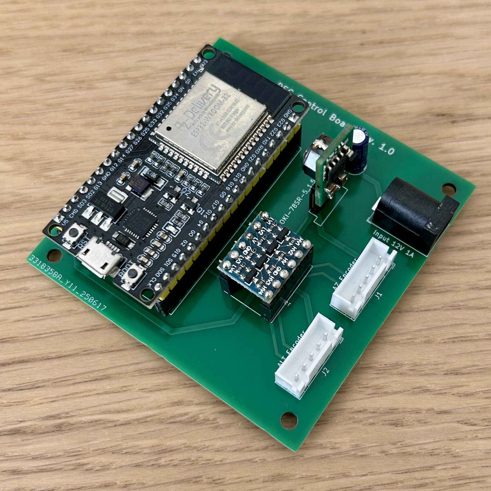
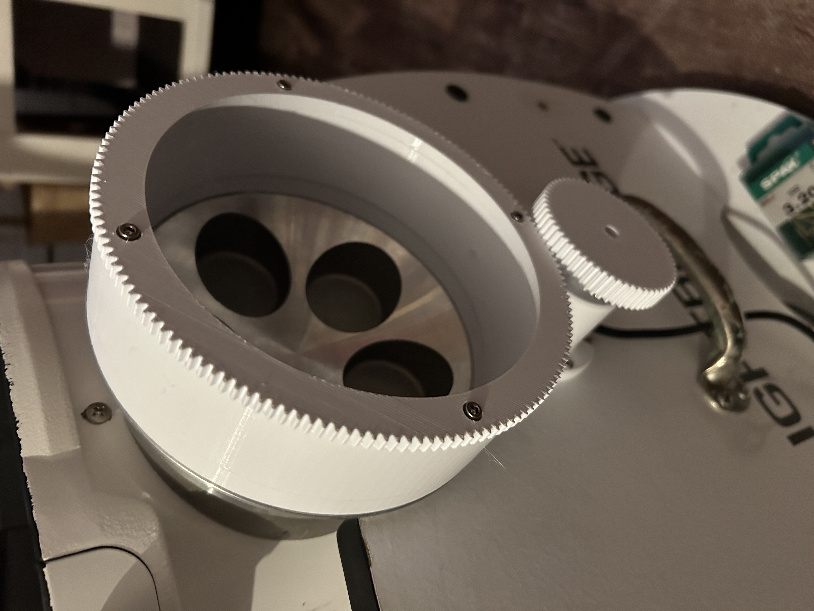
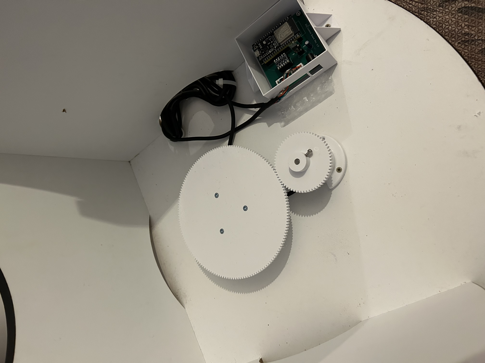

# Digital Setting Circles for a Manual Telescope Mount.

Design and code based on this GitHub project https://github.com/vlaate/DobsonianDSC. Code is converted to PlatformIO and a few bugs fixed (mostly due to newer dependencies having deprecated some usage patterns). A discussion thread on CloudyNights can be found here https://www.cloudynights.com/topic/589521-37-dobsonian-dsc-for-diy-makers/.

The PCB is designed for the NodeMCU DevKit C module. It is my own design.

The CAD files for the 10" Meade Lightbride are my own original design.
## PCB

The PCB is designed for the NodeMCU DevKit C. It uses 12V DC as power supply which should be readily available. It uses a 100uF input capacitor and 5V DC/DC converter to supply a stable voltage to the encoders. The ESP32 is not 5V tolerant on its GPIO pins which requires the 4-channel level shifter between NodeMCU and the encoders. 

The connectors to the encoders are JST-XH, which require a special crimp tool and some practice. The tool is extra 30€ or so but it’s well worth it in my opinion. The pinning is `+5V, GND, A, B, Shield/GND`.

The case for the board is a marginal fit because the screw holes are off by a few hundred micron. Apologies. If you want to fix it, I recommend updating the board layout in KiCAD and not the case in FreeCAD. It’s the board that has the odd measurements.

The Gerber files in the repository are suitable for JLPCB which I can highl recommend. A set of 5 boards cost me <10€.

## Software

The software needs to be compiled and uploaded with PlatformIO. Like the ArduinoIDE it's free. You need to install VSCode and the the PlatformIO extension. There are no changes needed to upload.
## Modifications on the 10" Meade Lightbridge

I use a gear driven mechanism for the encoder train. I decided against belts because the altitude axis needs to be easily to dismantle. The azimuth axis uses the same gear ratio. 

## Altitude Axis

The altitude gear is attached in three pieces: a mounting ring is glued onto the metal trunnion. The mounting ring has 4x M3 heat inserts. Then a spacer ring and the gear ring is threaded on with M3 screws.

The encoder is screwed into its mount. The encoder gear is loosely slid over the encoder and the proper spacing to the axis gear is determined. The gears should mesh well with a bit but not too much play. Mark the position and screw the encoder mount onto the base.

The axis gear has 155 teeth and the Encoder gear has 62. With 2400 pulses on the quadrature encoder this makes for 6000 steps across a 360° totation of the axis.

## Azimuth Axis

The azimuth gear is mounted in the azimuth tension knob. It's held onto the knob with four M3 screws. The setup is the same as the altitude gear: mounting ring, spacer and then the actual gear. Here, the spacer and gear are attached with individual screws.

The encoder is attached in a similar fashion than the altitude encoder. The gear itself is mounted reverse compared to the altitude axis. For the AZ gear, use the same STL file as-is for ALT gear on the encoder. Use your slicer to remove the upper 5mm of the gear so that the height of the gear mesh is correct.

The axis gear has 155 teeth and the Encoder gear has 62. With 2400 pulses on the quadrature encoder this makes for 6000 steps across a 360° totation of the axis.

## Bill-of-Materials

| Module  | Item                            | Pieces | Description                |
| ------- | ------------------------------- | ------ | -------------------------- |
| PCB     | NodeMCU DevKit C                | 1      |                            |
| PCB     | OKI-SR78-5/1.5-W36-C            | 1      | 5V DC/DC converter         |
| PCB     | Capacitor (100uF/>25V)          | 1      | 47uF is also ok            |
| PCB     | 4-Channel Level Shifter 5V~3.3V | 1      | needs VC/GND in the middle |
| PCB     | JST-XH 2.54 Plug & Socket       | 2      | need crimp tool also       |
| PCB     | 5.5x2.1 DC Socket               | 1      |                            |
| Encoder | 600 steps A/B Encoder           | 2      |                            |
| Misc    | M3 Screw Set                    | 1      |                            |
| Misc    | M3 Heat Insets                  | 20     |                            |
| Misc    | 3x20 Wood Screws                | 8      |                            |

